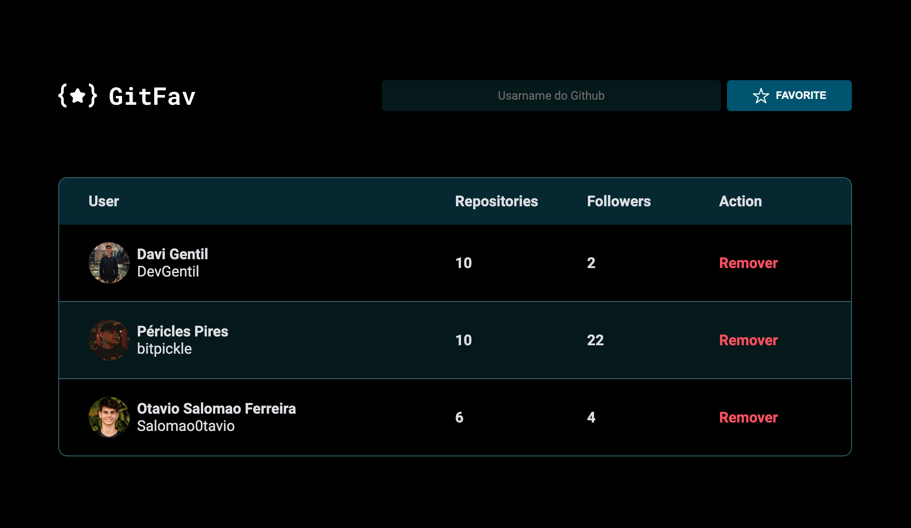

# GitFav

  

O GitFav é uma aplicação web que permite aos usuários buscar perfis do GitHub e salvá-los como favoritos de forma prática e rápida. O projeto foi estruturado com modernas práticas de desenvolvimento front-end, utilizando HTML, CSS e JavaScript para proporcionar uma experiência de usuário fluida e responsiva.

## Funcionalidades

- **Pesquisa de Usuários do GitHub**: Busque qualquer usuário do GitHub pelo nome de usuário.
- **Salvar como Favoritos**: Salve usuários pesquisados em uma lista de favoritos localmente no navegador.
- **Visualização de Dados**: Veja informações importantes como número de repositórios e seguidores diretamente na interface.
- **Gerenciamento de Favoritos**: Exclua usuários salvos na lista de favoritos conforme necessário.

## Estrutura do Projeto

O projeto é composto pelos seguintes arquivos principais:

- `index.html`: O arquivo HTML que estrutura a página da aplicação.
- `style.css`: Contém todos os estilos CSS para customização visual da aplicação.
- `main.js`: Arquivo JavaScript principal que inicializa a visualização dos favoritos.
- `GithubUser.js`: Define a classe que lida com a busca de usuários do GitHub via API.
- `Favorites.js`: Gerencia a lógica de adicionar e remover usuários favoritos.

## Projeto finalizado
- (https://devgentil.github.io/GitFav/)

Feito com ❤️ por [DevGentil](https://github.com/DevGentil).
